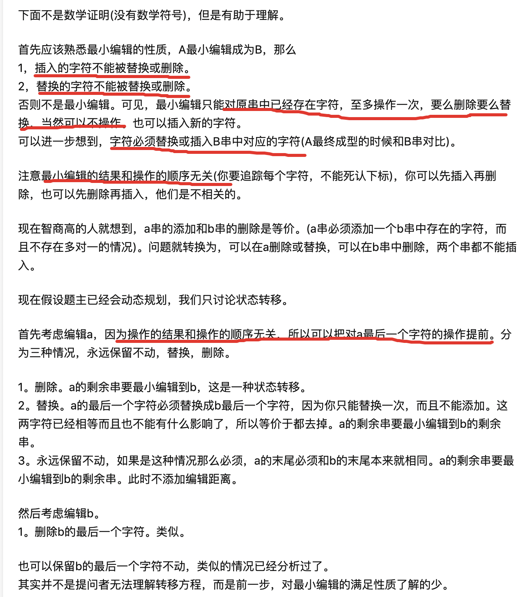

### 编辑距离（leetcode 72.）

***题目***：给你两个单词 word1 和 word2，请你计算出将 word1 转换成 word2 所使用的最少操作数 。

你可以对一个单词进行如下三种操作：
- 插入一个字符
- 删除一个字符
- 替换一个字符

***思路***：这道题是一道经典的DP题目，思考的方式也非常取巧。这里看到涉及到两个字符串的操作，遇到这种题目，我们一定要在纸上画一个二维矩阵，横纵坐标分别是两个字符串，然后逐个填充每个矩阵格子的值，寻找规律。按照我们的老套路，不妨定义dp[i][j]为把字符串str1[0……i]变为字符串str2[0……j]使用的最少操作次数。现在设想求dp[i][j]，如果str1[i] === str2[j]的话，那么显然，我们只需要求dp[i-1][j-1]就可以了。但是当str1[i] != str2[j]呢？按照这种思路来思考，要使两个字符串最后的这个字符相同，只有可能通过三种方式到达：
- str1删除掉一个字符，此时str1和str2完全相同。则要求str1[0……i-1]变成str2[0……j]，即删除掉str1[i]。
- str1添加一个字符，此时str1和str2完全相同。则要求str1[0……i]变成str2[0……j-1]，即在str1[i]后再添加一个等于str[j]的字符。
- str1的最后一个字符进行了替换，此时str1和str2完全相同。则要求str1[0……i-1]变成str2[0……j-1]，然后str1[i]替换成等于str[j]的字符。

***核心***：
- 状态：str1[0……i]和str2[0……j]
- 选择：删除，添加，替换，不动
- dp数组含义：把str1[0……i]变为str2[0……j]所需要的最少操作数
- base case：dp[0][j] = j; dp[i][0] = i;

总结一下，当两个字符串最后一个字符相同时，显然只需要让刨除最后一个字符的字符串str1变为刨除最后一个字符的字符串str2。当两个字符串中的最后一个字符不同时，那么为了让str1的最后字符与str2最后的字符相同，只能是通过三种变换来的，要么是删除了一个字符、要么是添加了一个字符、要么是替换了一个字符，只有通过这三种操作才能使得两个字符串的最后一个字符相同。而显然，解决剩余规模的问题就是递归，然后找出这三种变换方式的最小值，就是要求的最少编辑次数。

***状态转移方程***：

    dp[i][j] = dp[i-1][j-1], 当str1[i] === str2[j]时；
    dp[i][j] = Min(
        dp[i-1][j-1], // 替换
        dp[i-1][j], // 删除
        dp[i][j-1] // 添加
    ) + 1, 当str1[i] != str2[j]时；

之前总是困惑这个状态转移方程的正确性，用上面的思路思考固然可以，后来在知乎上又找到一个帮助理解的，如下：
