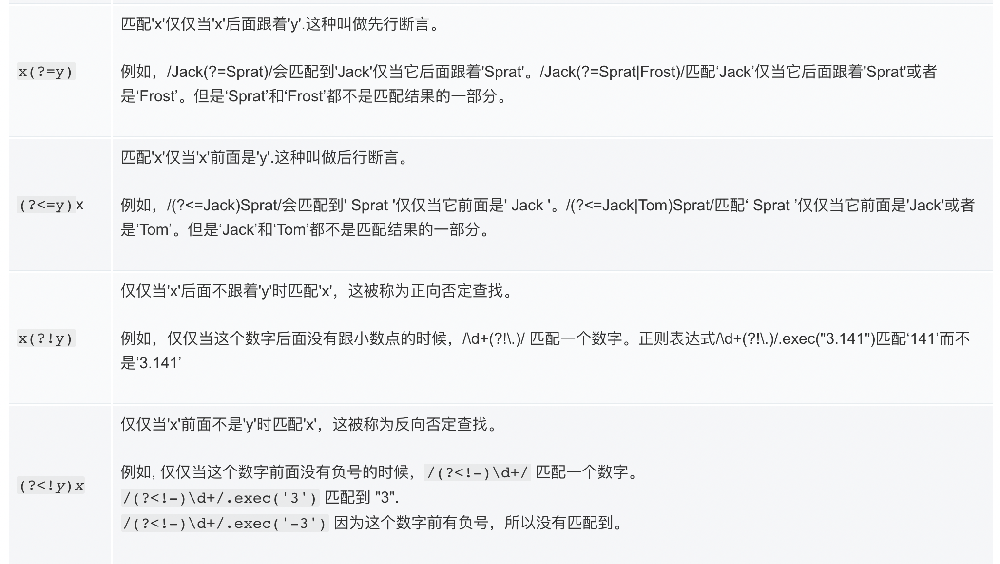

# 正则表达式常用语法汇总

## 元字符：
- \b：匹配单词的开头和结尾
- .：匹配除了换行符以外的任意字符
- \d：匹配一位数字
- \s：匹配任意的空白符（空格，制表符，换行符，中文全角空格等）
- \w：匹配字母或数字或下划线(亲测匹配不了汉字)
- ^：匹配字符串的开始
- $：匹配字符串的结束

## 转义字符：
有时候我们想匹配某个特殊的字符，例如想匹配'.'，直接写.会被认定为元字符语义，这时候应该使用转义字符\\.
- 元字符前面加上\，例如匹配'.'，就是\\.

## 重复：
- *：代表数量，指前边的内容可以连续重复使用任意次（可能是0次）
- +：重复1次或更多次
- ？：重复零次或1次
- {2}：表示前面的字符必须连续重复2次
- {5，12}：重复的次数不能少于5次，不能多于12次
- {n,}：重复n次或者更多次

## 字符类：
- [aeiou]：匹配任何一个英文元音字母，即匹配方括号中的任何一个字符
- [0-9]：匹配任意一个数字

## 分支条件：
- |：把不同的规则分开，满足其中任意一种规则都成为匹配  
注意各个条件的顺序！

## 分组：
想要匹配重复的多个字符，使用分组匹配
- （）：使用括号进行分组

## 反义：
- \W：匹配任意不是字母，数字，下划线，汉字的字符
- \S：匹配任意不是空白符的字符
- \D：匹配任意非数字的字符
- \B：匹配不是单词开头或结束的位置
- [^x]：匹配除了x以外的任意字符
- [^aeiou]：匹配除了aeiou这几个字母以外的任意字符

示例：\S+匹配不包含空白符的字符串
<a[^>]+>匹配用尖括号括起来的以a开头的字符串

## 后向引用：
使用小括号指定一个子表达式后，匹配这个子表达式的文本(也就是此分组捕获的内容)可以在表达式或其它程序中作进一步的处理。默认情况下，每个分组会自动拥有一个组号，规则是：从左向右，以分组的左括号为标志，第一个出现的分组的组号为1，第二个为2，以此类推。  

**后向引用** 用于重复搜索前面某个分组匹配的文本。例如，\1代表分组1匹配的文本。  
`\b(\w+)\b\s+\1\b`可以用来匹配重复的单词，像go go, 或者kitty kitty。这个表达式首先是一个单词，也就是单词开始处和结束处之间的多于一个的字母或数字`(\b(\w+)\b)`，这个单词会被捕获到编号为1的分组中，然后是1个或几个空白符(\s+)，最后是分组1中捕获的内容（也就是前面匹配的那个单词）(\1)。  
你也可以自己指定子表达式的组名。要指定一个子表达式的组名，请使用这样的语法：`(?<Word>\w+)`(或者把尖括号换成'也行：`(?'Word'\w+))`,这样就把\w+的组名指定为Word了。要反向引用这个分组捕获的内容，你可以使用\k<Word>,所以上一个例子也可以写成这样：  
`\b(?<Word>\w+)\b\s+\k<Word>\b`。

## 零宽断言
- `(?=exp)`零宽度正预测先行断言：它断言自身出现的位置的后面能匹配表达式exp。比如`\b\w+(?=ing\b)`，匹配以ing结尾的单词的前面部分(除了ing以外的部分)，如查找I'm singing while you're dancing.时，它会匹配sing和danc。
- `(?<=exp)`零宽度正回顾后发断言：它断言自身出现的位置的前面能匹配表达式exp。比如`(?<=\bre)\w+\b`会匹配以re开头的单词的后半部分(除了re以外的部分)，例如在查找reading a book时，它匹配ading。

从上面的例子可以看到，二者其实都是用来匹配一定的位置。但是这都TM什么鬼名字……

## 负向零宽断言
如果我们只想确保某个字符没有出现，但并不想平匹配它时应该怎么办？
- 零宽度负预测线性断言`(?!exp)`：断言此位置的后面不能匹配表达式exp。例如：`\d{3}(?!\d)`匹配三位数字，而且这三位数字的后面不能是数字；`\b((?!abc)\w)+\b`匹配不包含连续字符串abc的单词。
- 零宽度负回顾后发断言`(?<!exp)`：断言此位置的前面不能匹配表达式exp。例如：`(?<![a-z])\d{7}`匹配前面不是小写字母的七位数字。

同样的，这二者也是只是匹配位置，不用于零宽断言是是，这两个是“排除模式”，表示某个位置不能是某个pattern

## 贪婪与懒惰
- 贪婪匹配：当正则表达式中包含能接受重复的限定符时，通常的行为是（在使整个表达式能得到匹配的前提下）匹配尽可能多的字符。以这个表达式为例：`a.*b`，它将会匹配最长的以a开始，以b结束的字符串。如果用它来搜索aabab的话，它会匹配整个字符串aabab。
- 懒惰匹配：有时，我们更需要懒惰匹配，也就是匹配尽可能少的字符。前面给出的限定符都可以被转化为懒惰匹配模式，**只要在它后面加上一个问号?**。这样.*?就意味着匹配任意数量的重复，但是在能使整个匹配成功的前提下使用最少的重复。

*常用懒惰限定符*：
- `*?`: 重复任意次，但尽可能少重复
- `+?`: 重复1次或更多次，但尽可能少重复
- `??`: 重复0次或1次，但尽可能少重复
- `{n,m}?`: 重复n到m次，但尽可能少重复
- `{n,}?`: 重复n次以上，但尽可能少重复

## JS中使用正则
正则表达式可以被用于 RegExp 的 exec 和 test 方法以及 String 的 match、replace、search 和 split 方法。
1. 正则的声明：有两种声明方法
- 正则表达式字面量：`/pattern/flags`，pattern即为要进行匹配的正则规则，flags为高级标识位，例如g为全局搜索，i为不区分大小写
- 调用RegExp对象的构造函数：`new RegExp('ab+c')`
>如果你想将字符串传递给 RegExp 构造函数，不要忘记在字符串字面量中反斜杠是转义字符。所以为了在模式中添加一个反斜杠，你需要在字符串字面量中转义它。/[a-z]\s/i 和 new RegExp("[a-z]\\\s", "i") 创建了相同的正则表达式：一个用于搜索后面紧跟着空白字符（\s 可看后文）并且在 a-z 范围内的任意字符的表达式。为了通过字符串字面量给 RegExp 构造函数创建包含反斜杠的表达式，你需要在字符串级别和正则表达式级别都对它进行转义。例如 /[a-z]:\\/i 和 new RegExp("[a-z]:\\\\","i") 会创建相同的表达式，即匹配类似 "C:\" 字符串。
2. 使用方法：
- reg.exec(String): 一个在字符串中执行查找匹配的RegExp方法，它返回一个数组（未匹配到则返回 null）。
- reg.test(String): 一个在字符串中测试是否匹配的RegExp方法，它返回 true 或 false。
- str.match(reg): 一个在字符串中执行查找匹配的String方法，它返回一个数组，在未匹配到时会返回 null。
- str.matchAll(reg): 一个在字符串中执行查找所有匹配的String方法，它返回一个迭代器（iterator）。
- str.search(reg): 一个在字符串中测试匹配的String方法，它返回匹配到的位置索引，或者在失败时返回-1。
- str.replace(regexp|substr): 一个在字符串中执行查找匹配的String方法，并且使用替换字符串替换掉匹配到的子字符串。
- str.split(regexp|substr): 一个使用正则表达式或者一个固定字符串分隔一个字符串，并将分隔后的子字符串存储到数组中的 String 方法。

## 参考文章：
[正则表达式30分钟入门](https://deerchao.cn/tutorials/regex/regex.htm)  
强烈推荐： [MDN-正则表达式](https://developer.mozilla.org/zh-CN/docs/Web/JavaScript/Guide/Regular_Expressions)  
[Learn Regular Expressions In 20 Minutes](https://www.youtube.com/watch?v=rhzKDrUiJVk)  

在线测试正则表达式：  
https://regexr.com/  
https://deerchao.cn/tools/wegester/
